# ALADIN Digital Platform — WP2 Architecture Overview

**Work Package 2 · Platform Development**  
**Workshop — 12 May 2026**  
**Lead Partner:** Katty Fashion · Eduard Lazar  
**Partners:** Mitwill · NIL · DITF · VORN

---

> ALADIN is an EU-funded programme accelerating the adoption of digital product creation and manufacturing technologies across European textile and fashion SMEs. WP2 designs and delivers the modular digital platform that connects brands, designers, manufacturers, and consumers across the full garment lifecycle.

---

## 1. Platform Vision & Scope

The ALADIN Digital Platform is built on five capabilities that together enable B2B and B2B2C interactions across the fashion manufacturing value chain:

| Capability | WP2 Task | Lead |
|---|---|---|
| Platform architecture & user journeys | T2.1 | Katty Fashion |
| Core B2B ordering · Tech Pack · BOM · LLM ecodesign | T2.2 | Katty Fashion + VORN |
| Digital garment configurator · 3D visualisation | T2.3 | Mitwill + Katty Fashion |
| Digital Product Passport (DPP) · circularity dashboard | T2.4 | NIL + Katty Fashion |
| Production orchestration · interoperability toolkit | T2.5 | DITF + Katty Fashion |


---

## 2. Foundation — NuoForm Production Platform

The ALADIN platform is built on **NuoForm**, Katty Fashion's running order management system. This gives the programme a validated foundation to build upon.

### What NuoForm brings to ALADIN

| Domain                | Capability                                                     |
| --------------------- | -------------------------------------------------------------- |
| Order lifecycle       | Creation → model entry → pricing → completion                  |
| Tech Pack & BOM       | Size grading · component management · document generation      |
| Reception & inventory | Material inbound · waste tracking · quality assurance          |
| Manufacturing process | Tech process steps · operator assignment · machine definitions |
| Industry 4.0          | AAS Registry integration — digital twin per order and process  |
| Identity              | OAuth2 · OIDC · role-based access                              |
| Infrastructure        | Kubernetes · CI/CD · containerised · cloud-native              |

The ALADIN platform evolves NuoForm from a single-tenant microfactory system into a **multi-tenant B2B/B2B2C platform** capable of serving multiple SME partners simultaneously.

---

## 3. Platform Architecture — Three-Phase Progression

The architecture progresses in three phases aligned to the WP2 milestone schedule. Each phase is independently deliverable and backward compatible — partner services built in Phase 2 continue to work unchanged in Phase 3.

### 3.1 Phase 1 — Multi-tenant Platform Foundation (Now → M10)

```mermaid
---
title: Phase 1 — ALADIN Platform Foundation
---
%%{init: {
  "theme": "base",
  "themeVariables": {
    "fontFamily": "Helvetica, Arial, sans-serif",
    "fontSize": "14px",
    "lineColor": "#5F5E5A"
  },
  "flowchart": {
    "curve": "basis",
    "nodeSpacing": 50,
    "rankSpacing": 70,
    "padding": 16
  }
}}%%
flowchart TB
    subgraph Clients["Platform Users"]
        BR(["**Brands / B2B**"])
        CON(["**Consumers / B2C**"])
        MFG(["**Factory Operators**"])
        IOT(["**Factory Machines**<br/><i>IoT</i>"])
    end

    subgraph GatewayL["Access Layer"]
        GW{{"**API Gateway**<br/><i>OAuth2 · tenant routing · rate limiting</i>"}}
        KC["**Identity Provider**<br/><i>OAuth2 · OIDC · RBAC · multi-tenant</i>"]
    end

    NEXT["**Platform Dashboard**<br/><i>Next.js 15 · React 19</i>"]

    subgraph Monolith["NuoForm Platform — Modular"]
        TF{{"**Tenant Router**<br/><i>per-request data isolation</i>"}}

        subgraph OrderCtx["Order Domain"]
            OS["**Order Management**"]
            RS["**Reception**"]
            TS["**Task Management**"]
        end
        subgraph ModelCtx["Design Domain"]
            MS["**Model & Collections**"]
            CS["**Component & BOM**"]
            DS["**Document Generation**"]
        end
        subgraph MfgCtx["Manufacturing Domain"]
            TPS["**Tech Process**"]
            INV["**Inventory**"]
            QAS["**Quality Assurance**"]
        end
        subgraph PlatCtx["ALADIN Modules"]
            CONF["**Garment Configurator**<br/><i>T2.3</i>"]
            DPP_M["**DPP Module**<br/><i>T2.4</i>"]
            ORCH_M["**Orchestration**<br/><i>T2.5</i>"]
            LLM_M["**LLM Ecodesign**<br/><i>T2.2</i>"]
        end

        OUTBOX["**Event Publisher**<br/><i>domain events → AAS Registry</i>"]
        CACHE["**Cache Layer**<br/><i>per-tenant namespace</i>"]
    end

    subgraph IoTL["Factory IoT"]
        MOSQ["**MQTT Broker**<br/><i>machine events</i>"]
        MQTT_A["**IoT Adapter**<br/><i>event ingestion</i>"]
    end

    subgraph StorageL["Data Layer"]
        PG[("**PostgreSQL**<br/><i>row-level tenant isolation</i>")]
        MS_S[("**Object Storage**<br/><i>S3-compatible · per-tenant</i>")]
        REDIS[("**Cache**")]
    end

    subgraph ObsL["Observability"]
        OTEL_COL["**Telemetry Collector**"]
        GRAF["**Dashboards**<br/><i>metrics · logs · traces</i>"]
    end

    subgraph InfraL["Infrastructure"]
        K8S["**Kubernetes**<br/><i>auto-scaling · high availability</i>"]
        AAS["**AAS Registry**<br/><i>Industry 4.0</i>"]
    end

    BR & CON & MFG --> GW
    NEXT --> GW
    GW <--> KC
    GW --> TF
    IOT --> MOSQ --> MQTT_A --> ORCH_M
    TF --> OrderCtx & ModelCtx & MfgCtx & PlatCtx
    TF --> PG
    OUTBOX --> AAS
    Monolith --> CACHE & MS_S
    OTEL_COL --> GRAF
    K8S --> Monolith

    classDef actor    fill:#F1EFE8,stroke:#5F5E5A,stroke-width:2px,color:#2C2C2A,rx:8,ry:8
    classDef gateway  fill:#EEEDFE,stroke:#534AB7,stroke-width:2.5px,color:#26215C,rx:12,ry:12
    classDef service  fill:#E1F5EE,stroke:#0F6E56,stroke-width:2px,color:#085041,rx:8,ry:8
    classDef platform fill:#FEF3E2,stroke:#B86A00,stroke-width:2px,color:#5C3200,rx:8,ry:8
    classDef storage  fill:#E8F4FD,stroke:#1A6FA0,stroke-width:2px,color:#0D3D5C,rx:8,ry:8
    classDef infra    fill:#F5F5F5,stroke:#7A7A7A,stroke-width:1.5px,color:#3C3C3C,rx:8,ry:8

    class BR,CON,MFG,IOT actor
    class GW,TF gateway
    class KC,NEXT,MOSQ,MQTT_A,OTEL_COL service
    class OS,RS,TS,MS,CS,DS,TPS,INV,QAS service
    class CONF,DPP_M,ORCH_M,LLM_M platform
    class OUTBOX,CACHE infra
    class PG,MS_S,REDIS storage
    class GRAF,K8S,AAS infra
```

**Phase 1 delivers:**
- Multi-tenant data isolation — each SME's data is fully separated at the database level
- OAuth2 access control — role and scope-based permissions per persona
- API Gateway — single entry point for all platform services with tenant-aware routing
- Factory IoT integration — machine events flow directly into the orchestration module
- Industry 4.0 — orders published as Asset Administration Shell (AAS) digital twins
- Full observability — metrics, logs, and traces across all platform components

### 3.2 Phase 2 — Event-Driven Integration Bus (M10 → M16)

Partner services (NIL, DITF, Mitwill, VORN) become independently deployable, connected to the platform via a high-throughput event bus. The NuoForm core is unchanged — only the integration surface expands.

```mermaid
---
title: Phase 2 — Partner services connected via event bus
---
%%{init: {
  "theme": "base",
  "themeVariables": {
    "fontFamily": "Helvetica, Arial, sans-serif",
    "fontSize": "14px",
    "lineColor": "#5F5E5A"
  },
  "flowchart": {
    "curve": "basis",
    "nodeSpacing": 55,
    "rankSpacing": 80,
    "padding": 16
  }
}}%%
flowchart TB
    subgraph Core["NuoForm Platform — unchanged core"]
        OUTBOX2["**Event Publisher**<br/><i>domain events → bus</i>"]
        CONSUMER["**Event Consumer**<br/><i>receives partner replies</i>"]
    end

    subgraph RP["Event Bus — Redpanda"]
        direction LR
        RP_ORD{{"**orders.&#123;tenant&#125;**"}}
        RP_MDL{{"**models.&#123;tenant&#125;**"}}
        RP_DPP{{"**dpp.&#123;tenant&#125;**"}}
        RP_ORCH{{"**orchestration.&#123;tenant&#125;**"}}
        RP_AUDIT{{"**audit**<br/><i>immutable · 90d</i>"}}
        SR_RP["**Schema Registry**<br/><i>Avro contracts</i>"]
    end

    subgraph PartnerSvcs["Partner Services — independently deployed"]
        DPP_SVC["**DPP Service**<br/><i>NIL · EPCIS · GS1 Digital Link</i><br/><i>T2.4</i>"]
        ORCH_SVC["**Orchestration Service**<br/><i>DITF · rule-based task routing</i><br/><i>T2.5</i>"]
        CONF_SVC["**Configurator Service**<br/><i>Mitwill · 3D visualisation</i><br/><i>T2.3</i>"]
        LLM_SVC["**LLM Ecodesign**<br/><i>VORN · sustainability suggestions</i><br/><i>T2.2</i>"]
    end

    subgraph PartnerData["Partner Data Stores"]
        DPP_DB[("**DPP Store**<br/><i>EPCIS compliant</i>")]
        ORCH_DB[("**Orchestration DB**")]
        LLM_STORE[("**Vector Store**<br/><i>model embeddings</i>")]
    end

    OUTBOX2 -->|"publish"| RP_ORD & RP_MDL
    RP_ORD -->|"subscribe"| DPP_SVC & ORCH_SVC & LLM_SVC
    RP_MDL -->|"subscribe"| CONF_SVC & DPP_SVC
    DPP_SVC -->|"publish"| RP_DPP
    ORCH_SVC -->|"publish"| RP_ORCH
    CONSUMER -->|"subscribe"| RP_DPP & RP_ORCH
    DPP_SVC --> DPP_DB
    ORCH_SVC --> ORCH_DB
    LLM_SVC --> LLM_STORE
    SR_RP -.->|"schema validation"| RP_ORD & RP_MDL & RP_DPP & RP_ORCH

    classDef service  fill:#E1F5EE,stroke:#0F6E56,stroke-width:2px,color:#085041,rx:8,ry:8
    classDef broker   fill:#EEEDFE,stroke:#534AB7,stroke-width:2.5px,color:#26215C,rx:12,ry:12
    classDef partner  fill:#FDE8F1,stroke:#A0215E,stroke-width:2px,color:#5C0F30,rx:8,ry:8
    classDef storage  fill:#E8F4FD,stroke:#1A6FA0,stroke-width:2px,color:#0D3D5C,rx:8,ry:8
    classDef infra    fill:#F5F5F5,stroke:#7A7A7A,stroke-width:1.5px,color:#3C3C3C,rx:8,ry:8

    class OUTBOX2,CONSUMER service
    class RP_ORD,RP_MDL,RP_DPP,RP_ORCH,RP_AUDIT broker
    class SR_RP infra
    class DPP_SVC,ORCH_SVC,CONF_SVC,LLM_SVC partner
    class DPP_DB,ORCH_DB,LLM_STORE storage
```

**Phase 2 delivers:**
- Each partner organisation deploys and operates their service autonomously
- Tenant isolation enforced at the event bus level — no cross-tenant event leakage
- Schema Registry ensures event contracts are versioned and backward compatible
- Immutable audit log — all domain events retained for 90 days across all tenants

### 3.3 Phase 3 — Fully Distributed Platform (M16 → Post-MVP)

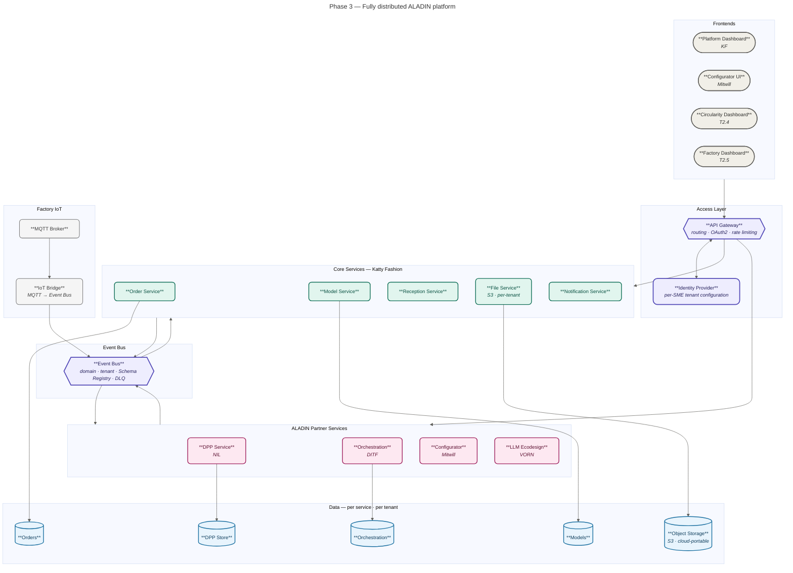

---

## 4. Multi-tenancy — SME Isolation Model

Each SME on the ALADIN platform is a fully isolated tenant. Data, events, files, and access tokens are scoped to the tenant at every layer.

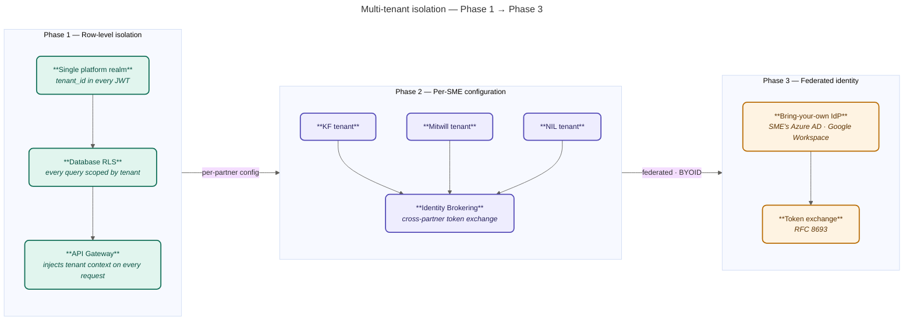

---

## 5. Identity & Access — OAuth2.0

The platform uses **OAuth2.0 / OIDC** as the universal authentication and authorisation layer. Every user, partner service, and machine integration authenticates through a single identity layer, with scopes determining exactly what each actor can access.

### 5.1 Access flows by actor type

| Actor | Flow | Token | Notes |
|---|---|---|---|
| Brand / designer | Authorization Code + PKCE | JWT | Interactive dashboard |
| Factory operator | Authorization Code + PKCE | JWT | Factory-scoped view |
| Quality controller | Authorization Code + PKCE | JWT | QA module access |
| Sustainability auditor | Authorization Code + PKCE | JWT | DPP · circularity read |
| Consumer / hobbyist | Authorization Code + PKCE | JWT | Configurator · DPP read |
| Partner service (NIL, DITF, Mitwill, VORN) | Client Credentials | JWT | M2M · event bus + REST |
| Developer / CI integration | Personal Access Token (PAT) | Opaque → JWT | Automation · webhooks |
| ALADIN platform admin | Authorization Code + PKCE | JWT + refresh | Tenant provisioning |

> Persona granularity will increase following the T2.1 user journey analysis. The architecture is designed so that new personas and scopes require only identity provider configuration — no platform code changes.

### 5.2 OAuth2 scope model

| Scope | Access granted | Assigned to |
|---|---|---|
| `orders:read` | Order data (read) | Brands · DPP Service · Orchestration |
| `orders:write` | Order creation and management | Brands |
| `models:read` | Model and collection data | Brands · Configurator |
| `models:write` | Model and BOM management | Brands · Designers |
| `dpp:read` | Digital Product Passport (read) | Brands · Consumers · Auditors |
| `dpp:write` | DPP creation and updates | NIL DPP Service |
| `orchestration:write` | Production task routing | DITF Orchestration Service |
| `qa:write` | Quality control records | Quality controllers |
| `files:write` | Document and asset upload | Brands · Factory operators |
| `admin:tenants` | SME tenant provisioning | ALADIN platform admin |

---

## 6. Partner Integration Surface

These are the stable contracts across which partner services integrate. Contracts are versioned — once a partner service consumes an API or event topic, the contract is frozen and only extended additively.

### 6.1 REST API — routed via API Gateway

| Route | Service owner | Auth |
|---|---|---|
| `/api/orders/**` | Katty Fashion | JWT + tenant scope |
| `/api/models/**` | Katty Fashion | JWT + tenant scope |
| `/api/dpp/**` | NIL | JWT + tenant scope |
| `/api/orchestration/**` | DITF | JWT + tenant scope |
| `/api/configurator/**` | Mitwill | JWT + tenant scope |
| `/api/llm/**` | VORN | JWT + tenant scope |

**Standard headers on every request:**
```
X-Tenant-ID   : {SME tenant identifier — injected by API Gateway}
X-Request-ID  : {trace correlation UUID}
```

### 6.2 Event contracts (Avro schema — tenant-namespaced topics)

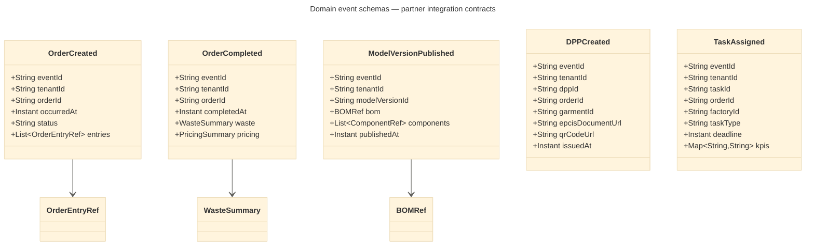

### 6.3 Factory IoT — MQTT

```
Topic pattern : kf/{tenant-id}/machine/{machine-id}/{event-type}
QoS           : 1 (at least once delivery)

Event types:
  step-completed    — manufacturing step finished
  defect-detected   — quality issue flagged
  production-kpi    — throughput and efficiency metrics
```

### 6.4 Industry 4.0 — AAS Digital Twin

Every completed order is published as an Asset Administration Shell (AAS) submodel to the ALADIN AAS Registry, enabling interoperability with external manufacturing execution systems including SIEMENS Teamcenter.

```
Order submodel:    urn:katty-fashion:order:{orderId}
  → CoreOrder · WasteReport · PricingSummary · OrderEntries

Process submodel:  urn:katty-fashion:process:{techProcessId}
  → ProcessSteps · Operators · Machines
```

### 6.5 Webhooks — for partners without event bus consumers

Partners that cannot run an event bus consumer receive domain events via signed webhook delivery.

```
POST  {partner-webhook-url}
X-ALADIN-Event       : OrderCreated
X-ALADIN-Tenant      : {tenantId}
X-ALADIN-Signature   : HMAC-SHA256({secret}, {body})
Retry: exponential backoff · 5 attempts · dead-letter on failure
```

---

## 7. Object Storage — Cloud-Portable

All platform file storage uses an S3-compatible API layer that abstracts the underlying storage provider. This enables the platform to run entirely self-hosted today and migrate to cloud object storage (AWS S3 and associated services) without any application code changes.

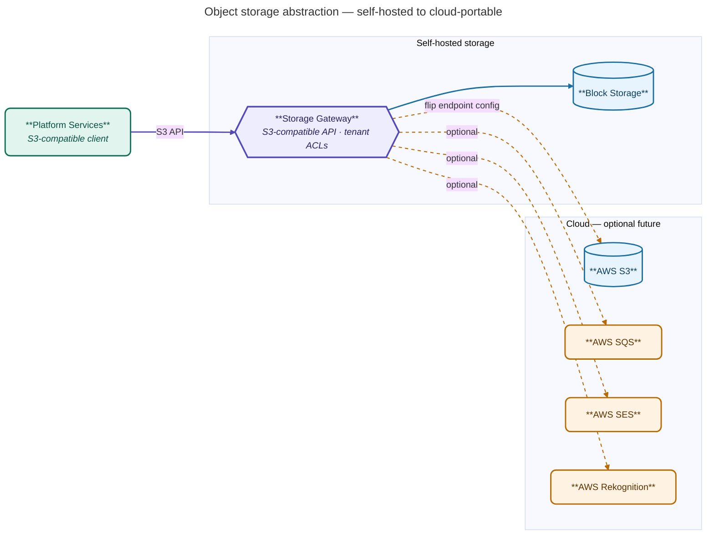

**Per-tenant bucket isolation:**
```
tenant-{uuid}/orders/     — order documents, DXF files
tenant-{uuid}/models/     — 3D assets, tech packs
tenant-{uuid}/dpp/        — DPP media and certificates
```

---

## 8. Cross-WP Dependencies — WP1 & WP4

The ALADIN platform cannot be built in isolation. Two work packages feed directly into WP2 deliverables and consume WP2 outputs in return. These dependencies must be agreed, dated, and owned before platform development proceeds at pace.

---

### 8.1 WP1 → WP2 — Personas, journeys, use cases

WP1 defines the strategic and human foundation. WP2 translates this into platform architecture and feature scope.

| WP1 Task | What WP1 provides | WP2 task that consumes it | Needed by | Format |
|---|---|---|---|---|
| T1.1 Market segmentation & user needs | Target group profiles, SME ecosystem map, UVP inputs | T2.1 Platform architecture & user journeys | M3 | Structured persona specs |
| T1.1 User needs | Product and service needs per user type | T2.3 Configurator scope · T2.2 B2B features | M4 | Requirements doc |
| T1.2 Ecodesign & R-strategies | Design inputs, material sustainability criteria | T2.2 LLM ecodesign pipeline · T2.4 DPP data model | M5 | R-strategy taxonomy |
| T1.3 Business model development | Monetisation models, B2B/B2C UVP, circular revenue logic | T2.1 UX architecture · T2.2 dashboards | M6 | Business model canvas |

**WP2 → WP1** (what WP2 returns):

| WP2 task | What WP2 provides back | WP1 benefit |
|---|---|---|
| T2.1 User journeys | Validated end-to-end workflows per persona | Grounds WP1 persona research in real platform behaviour |
| T2.2 Core platform | Tech Pack, BOM, order flow live in platform | Evidence base for WP1 monetisation strategy |
| T2.4 DPP module | Lifecycle traceability, circularity dashboard | Enables WP1 circular business models with live data |

---

### 8.2 WP4 → WP2 — Materials, workflows, KPIs

WP4 develops the physical use cases and production technologies. WP2 must capture, expose, and trace this data through the digital platform.

| WP4 Task | What WP4 provides | WP2 task that consumes it | Needed by | Format / integration point |
|---|---|---|---|---|
| T4.1 Material sourcing & mapping | Local/biobased material specs, performance data, sourcing criteria for kidswear parka and dress-blazer | T2.4 DPP — material data fields · T2.2 BOM material attributes | M6 | Material data schema → DPP attribute definitions |
| T4.3 Circular design of use cases | DPP attribute definitions, ESPR requirements, 3D model specs, circular feature parameters (modularity, recyclability) | T2.4 DPP data model · T2.3 Configurator parameters · T2.2 Tech Pack validation | M8 | DPP data contract, configurator parameter schema |
| T4.4 Production trials | Trial KPIs, waste metrics, quality data, fit/construction feedback from 5–10 garments per use case | T2.5 Orchestration KPI dashboard · T2.2 order tracking · T2.4 DPP lifecycle records | M12 | REST events → orchestration API · AAS process submodel |
| T4.6 Automation self-assessment | Automation capabilities per partner (circular knitting, flat-knitting, cutting, digital printing) | T2.5 Orchestration interoperability toolkit · ERP/MES middleware requirements | M10 | Integration requirements doc · middleware validation |

**WP2 → WP4** (what WP2 provides to WP4):

| WP2 task | What WP2 provides | WP4 benefit |
|---|---|---|
| T2.2 Tech Pack + BOM | Production-ready parameters, material inputs, size grading | Feeds T4.3 design validation — configurator inputs translate to production specs |
| T2.3 Configurator | 3D garment configurability, modular design parameters | Enables T4.3 digital/physical prototype alignment |
| T2.4 DPP | Traceability records, EPCIS events, sustainability impact data | Feeds T4.4 production trial validation and T6.3 LCA/PCF assessment |
| T2.5 Orchestration | Task routing, factory dashboard, real-time KPI monitoring | Directly manages T4.4 production trial workflows in the KF microfactory |

---

### 8.3 Integration decisions — to be agreed at this workshop

The following decisions are needed before WP2 development can proceed on DPP, Configurator, and Orchestration modules.

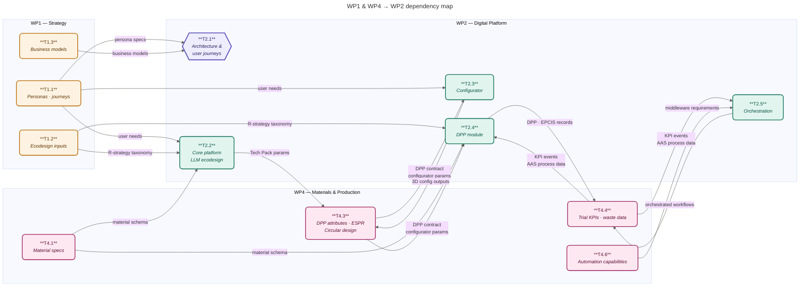

| Decision | Options | Owner | Needed by |
|---|---|---|---|
| DPP minimum data contract | Which WP4 material and ESPR fields are mandatory at MVP vs optional | NIL + KF (T4.3 + T2.4) | M6 |
| Orchestration KPI schema | Which trial KPIs from T4.4 are tracked in the factory dashboard | DITF + KF (T4.4 + T2.5) | M8 |
| Material data ownership | WP4 authors spec → WP2 platform stores and serves → who can update | WP2 + WP4 leads | M5 |
| Data tenancy for WP4 trial data | KF tenant only (Phase 1) vs shared multi-partner namespace (Phase 2) | KF + DITF | M5 |
| API vs event for trial data | Trial KPIs delivered as REST push or event bus topic subscription | T2.5 + T4.4 leads | M8 |
| Configurator ↔ Tech Pack link | How T4.3 physical design constraints constrain T2.3 configurator options | Mitwill + KF | M7 |

---

### 8.4 Dependency risk register

| Risk | Impact | Mitigation |
|---|---|---|
| WP4 DPP attributes undefined past M6 | T2.4 DPP module built on assumptions — rework cost | Lock minimum DPP data contract at this workshop; remaining fields can be added additively |
| WP1 personas not delivered by M4 | T2.1 architecture proceeds without validated user needs | Use KF operator + brand personas as interim baseline; WP1 refines in M4–M6 |
| WP4 trial KPIs not agreed before T2.5 build | Orchestration dashboard built for wrong metrics | Co-define KPI schema in joint WP2/WP4 session by M8 |
| WP4 material specs change after T2.4 DPP is built | Schema migration cost; DPP records invalid | Agree additive-only policy after M8 contract freeze |
| Cross-WP data ownership ambiguity | Blocked API access or duplicated stores | Assign one data author per domain in this workshop; resolve tenancy model M5 |

---

## 9. Proposed WP2 Roadmap

The platform evolves in three distinct phases, each independently deliverable. Phase 1 strengthens and extends the existing NuoForm production system. Phase 2 connects all partner services via an event bus. Phase 3 completes the transition to a fully distributed architecture. Each phase is backward compatible — work built in Phase 1 runs unchanged through Phase 3.

### 9.1 WP2 Delivery — Gantt

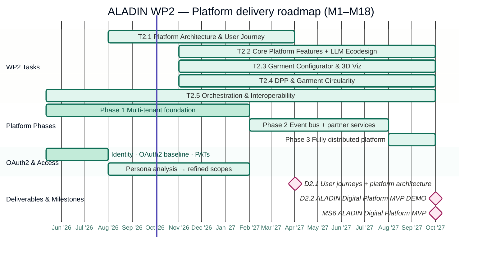

---

### 9.2 Phase 1 — Multi-tenant Platform Foundation · Now → M10

Platform foundation is established on the existing NuoForm production system. All ALADIN modules (T2.2–T2.5) are delivered as capabilities within a hardened, multi-tenant monolith. No partner services are independent yet — this phase proves the architecture works at real production scale before distributing it.

```mermaid
---
title: Phase 1 · Now → M10 — Multi-tenant Platform Foundation
---
%%{init: {
  "theme": "base",
  "themeVariables": {
    "fontFamily": "Helvetica, Arial, sans-serif",
    "fontSize": "14px",
    "lineColor": "#5F5E5A"
  },
  "flowchart": { "curve": "basis", "nodeSpacing": 48, "rankSpacing": 64, "padding": 16 }
}}%%
flowchart TB
    PHASE{{"**Phase 1 · Now → M10**<br/><i>Multi-tenant Platform Foundation</i>"}}

    subgraph ACC["Access & Identity"]
        A1["**API Gateway**<br/><i>OAuth2 · tenant routing · rate limiting</i>"]
        A2["**Identity Provider**<br/><i>OIDC · RBAC · multi-tenant</i>"]
        A3["**Personal Access Tokens**<br/><i>developer + CI automation</i>"]
    end

    subgraph ISO["Multi-tenancy — Data Isolation"]
        D1["**Row-Level Security**<br/><i>per-request tenant scoping in PostgreSQL</i>"]
        D2["**Per-tenant object storage**<br/><i>bucket isolation · S3-compatible API</i>"]
        D3["**Cache namespacing**<br/><i>per-tenant key isolation</i>"]
    end

    subgraph MOD["Platform Modules — T2.2 · T2.3 · T2.4 · T2.5"]
        M1["**Core Platform**<br/><i>Tech Pack · BOM · order lifecycle · LLM ecodesign</i>"]
        M2["**Garment Configurator**<br/><i>basic customisation · T2.3</i>"]
        M3["**DPP module**<br/><i>data capture · circularity dashboard · T2.4</i>"]
        M4["**Orchestration**<br/><i>task routing · factory dashboard · KPI tracking · T2.5</i>"]
    end

    subgraph INF["Infrastructure"]
        I1["**Factory IoT**<br/><i>MQTT broker · machine event ingestion</i>"]
        I2["**AAS Digital Twin**<br/><i>orders + processes published to registry</i>"]
        I3["**Observability**<br/><i>distributed tracing · metrics · logs</i>"]
        I4["**Kubernetes**<br/><i>auto-scaling · high availability</i>"]
    end

    PHASE --> A1 & D1 & M1 & I1

    classDef phase fill:#EEEDFE,stroke:#534AB7,stroke-width:2.5px,color:#26215C,rx:12,ry:12
    classDef p1    fill:#E1F5EE,stroke:#0F6E56,stroke-width:2px,color:#085041,rx:8,ry:8

    class PHASE phase
    class A1,A2,A3,D1,D2,D3,M1,M2,M3,M4,I1,I2,I3,I4 p1
```

**Phase 1 delivers for the consortium:** each SME's data is fully isolated at the database level · all ALADIN modules accessible via a single secured entry point · factory IoT and AAS Digital Twin operational · platform ready for partner service integration in Phase 2.

---

### 9.3 Phase 2 — Event-Driven Integration Bus · M10 → M16

Partner services (NIL, DITF, Mitwill, VORN) become independently deployable, each consuming events from and publishing results to a shared event bus. The NuoForm core is unchanged — the integration surface expands around it. WP4 data flows (material specs, trial KPIs, circular design constraints) become live platform data in this phase.

```mermaid
---
title: Phase 2 · M10 → M16 — Event-Driven Integration Bus
---
%%{init: {
  "theme": "base",
  "themeVariables": {
    "fontFamily": "Helvetica, Arial, sans-serif",
    "fontSize": "14px",
    "lineColor": "#5F5E5A"
  },
  "flowchart": { "curve": "basis", "nodeSpacing": 48, "rankSpacing": 64, "padding": 16 }
}}%%
flowchart TB
    PHASE{{"**Phase 2 · M10 → M16**<br/><i>Event-Driven Integration Bus</i>"}}

    subgraph BUS["Event Bus"]
        E1["**Tenant-namespaced topics**<br/><i>orders · models · dpp · orchestration · audit</i>"]
        E2["**Schema Registry**<br/><i>Avro contracts · versioned · backward-compatible</i>"]
        E3["**Immutable audit log**<br/><i>all events · 90-day retention per tenant</i>"]
    end

    subgraph PS["Partner Services — independently deployed"]
        P1["**DPP Service · NIL**<br/><i>EPCIS · GS1 Digital Link · T2.4</i>"]
        P2["**Orchestration Service · DITF**<br/><i>smart task routing · T2.5</i>"]
        P3["**Configurator Service · Mitwill**<br/><i>3D garment visualisation · T2.3</i>"]
        P4["**LLM Ecodesign · VORN**<br/><i>sustainability suggestions on Tech Pack · T2.2</i>"]
    end

    subgraph WP4F["WP4 Data Flows — live in platform"]
        W1["**Material specs**<br/><i>T4.1 → DPP records + BOM attributes</i>"]
        W2["**Trial KPIs**<br/><i>T4.4 → Orchestration dashboard + AAS submodel</i>"]
        W3["**Circular design constraints**<br/><i>T4.3 → Configurator params + Tech Pack</i>"]
    end

    PHASE --> E1 & P1 & W1

    classDef phase   fill:#EEEDFE,stroke:#534AB7,stroke-width:2.5px,color:#26215C,rx:12,ry:12
    classDef bus     fill:#EEEDFE,stroke:#534AB7,stroke-width:2px,color:#26215C,rx:8,ry:8
    classDef partner fill:#FDE8F1,stroke:#A0215E,stroke-width:2px,color:#5C0F30,rx:8,ry:8
    classDef wp4     fill:#FEF3E2,stroke:#B86A00,stroke-width:2px,color:#5C3200,rx:8,ry:8

    class PHASE phase
    class E1,E2,E3 bus
    class P1,P2,P3,P4 partner
    class W1,W2,W3 wp4
```

**Phase 2 delivers for the consortium:** each partner organisation deploys and operates their service autonomously · tenant isolation enforced at the event bus level · WP4 physical use case data flows directly into DPP, Orchestration, and Configurator · platform ready for the D2.2 MVP demonstration.

---

### 9.4 Phase 3 — Fully Distributed Platform · M16 → Post-MVP

The platform core is decomposed into independently deployable services. Each partner is fully self-sufficient. Federated identity enables SMEs to bring their own identity provider. Cloud portability is available without code changes.

```mermaid
---
title: Phase 3 · M16 → Post-MVP — Fully Distributed Platform
---
%%{init: {
  "theme": "base",
  "themeVariables": {
    "fontFamily": "Helvetica, Arial, sans-serif",
    "fontSize": "14px",
    "lineColor": "#5F5E5A"
  },
  "flowchart": { "curve": "basis", "nodeSpacing": 48, "rankSpacing": 64, "padding": 16 }
}}%%
flowchart TB
    PHASE{{"**Phase 3 · M16 → Post-MVP**<br/><i>Fully Distributed Platform</i>"}}

    subgraph CORE["Distributed Core Services"]
        K1["**Order Service**<br/><i>extracted from monolith · own database</i>"]
        K2["**Model Service**<br/><i>collections + BOM · independently deployable</i>"]
        K3["**Reception Service**<br/><i>material inbound + QA · independently deployable</i>"]
    end

    subgraph FED["Federated Identity"]
        F1["**Bring-your-own IdP**<br/><i>Azure AD · Google Workspace · per-SME configuration</i>"]
        F2["**Token exchange · RFC 8693**<br/><i>cross-partner auth without credential sharing</i>"]
    end

    subgraph CLOUD["Cloud Portability & Replication"]
        C1["**S3 migration-ready**<br/><i>flip endpoint config → AWS S3 · zero code changes</i>"]
        C2["**Partner autonomy**<br/><i>each partner fully self-sufficient · own infrastructure</i>"]
        C3["**Replication blueprint**<br/><i>containerised templates · SME onboarding guide</i>"]
    end

    PHASE --> K1 & F1 & C1

    classDef phase fill:#EEEDFE,stroke:#534AB7,stroke-width:2.5px,color:#26215C,rx:12,ry:12
    classDef p3    fill:#FEF3E2,stroke:#B86A00,stroke-width:2px,color:#5C3200,rx:8,ry:8
    classDef fed   fill:#E8F4FD,stroke:#1A6FA0,stroke-width:2px,color:#0D3D5C,rx:8,ry:8

    class PHASE phase
    class K1,K2,K3,C1,C2,C3 p3
    class F1,F2 fed
```

**Phase 3 delivers for the consortium:** full microservices architecture · federated identity for SME BYOID · cloud-portable storage · containerised replication blueprint for ALADIN network expansion beyond the initial consortium.

---

## 10. Deliverables Summary

| ID | Deliverable | Lead | Type | Due |
|---|---|---|---|---|
| **D2.1** | User journeys and platform architecture | KF | Report | M12 · Apr 2027 |
| **D2.2** | ALADIN Digital Platform MVP DEMO 1 | KF | Demonstration | M18 · Oct 2027 |
| **MS6** | ALADIN Digital Platform MVP | KF | Milestone | M18 · Oct 2027 |

**MS6 verification:** brands and SME partners can interact with the ALADIN Digital Platform; the DPP dashboard tracks and stores lifecycle data end-to-end.

---

*ALADIN is funded by the European Union. Views and opinions expressed are those of the authors only and do not necessarily reflect those of the European Union or the European Research Executive Agency (REA). Neither the European Union nor the granting authority can be held responsible.*
